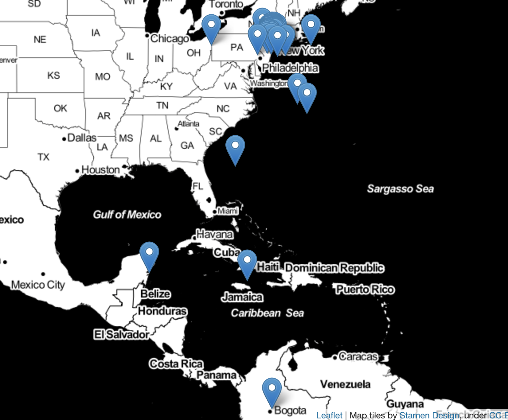
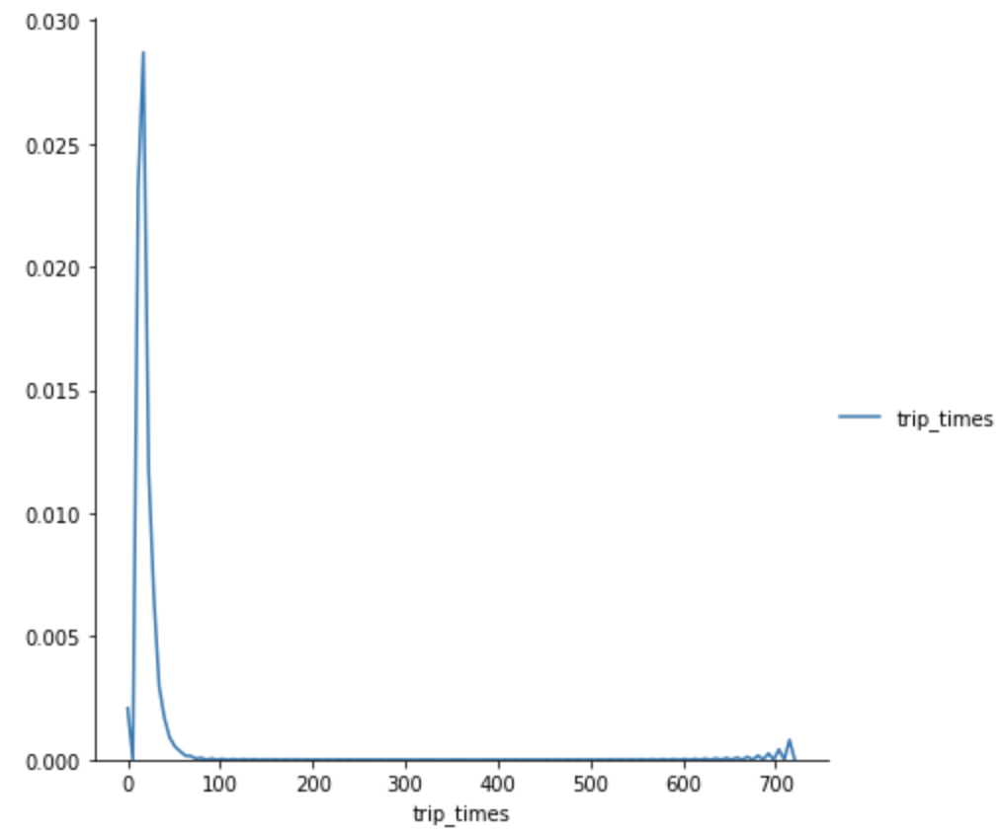
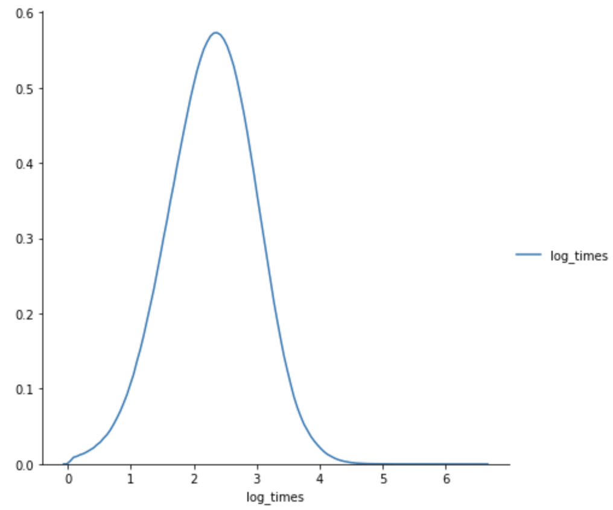
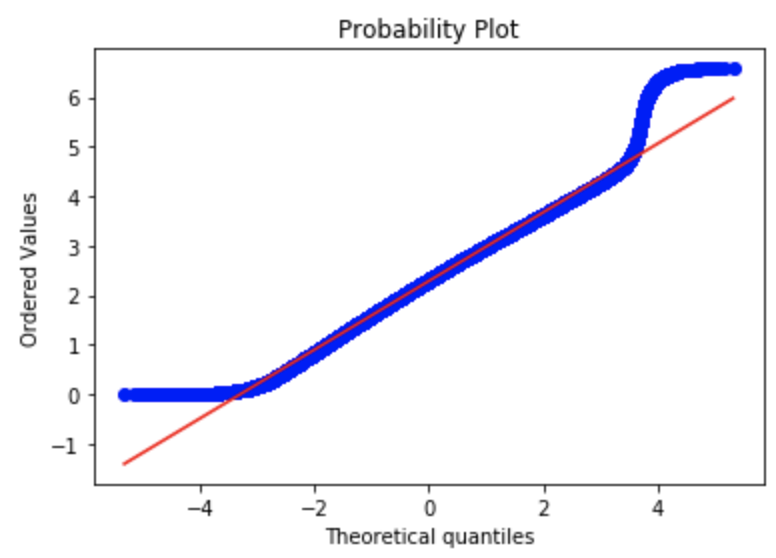

## Quick Introduction
  **Regions obtained after clustering the latitudes/longitudes in the dataset**
 

**Problem Statement:**
- Objective:
    - At a given time and location in NYC we want to predict the number of pickups in a 10 minutes interval.
- Constraints:
    - Latency, we expect the ML model to give us the result in a few seconds. Imagine a senario where you are a cab driver in NYC, you wouldn't want to wait 5 minutes to see the number of pickups in the region surrounding your current location.
    - Interpretability is not very important.
    - Relative errors:
      Example: 
        r1 -> 5:40 - 5:50 -> 100 pick ups, actual -> 102 -> error -> 2%
        r2 -> 5:40 - 5:50 -> 10 pick ups, actual -> 12 -> error -> 20%
        we care about the % error not the absolute error.
 
## Approach
Our problem is a regression task with temporal data, essentially time-series prediction.

1. Cluster NYC into regions using K-means clustering, while doing so we have to make sure that the cluster sizes make sense, as if we have very small clusters(>0.5 miles) i.e esentially saying our cab driver to move from his current location to the end of the road! At the same time we don't want to cluste sizes to be very large(<2.0 miles).

2. Time Binning: Used unix time stamps to bin data to 10 minute intervals. 

Given a clusterId and 10 minute time interval we want to predict the number of pickups. I've used the 2015 data to train the models and 2016 data to test the model performance.

**Performace Metrics:**
  - Mean Absolute Percentage Error(MAPE)
  - Mean Squared Error(MSE)
  

## Results 
1. Used dask to handle massive datasets in this project.
2. Cleaned outliers from the data based on legal constraints, analysis on latitudes/longitudes, trip duration/distance/speed/fare analysis.
3. Segmented NYC into regions based on latitude and longitude usign K-means, used elbow method to find the optimal k.
4. Used Fourier Transforms to featurize the time-series data.
5. Used various classical time-series prediction models as baseline models, some of the models tried are simple/weighted moving average, exponential weighted moving average, grid searched the parameters of these models, yeilding the following results.

    **Performance of baseline models:**
    | Time Series Model             | MAPE             | MSE          |
    | ------------------------------| -----------------|--------------|
    | Moving Averages               | 16.8 %           | 353          |
    | Weighted Moving Averages      | 16 %             | 303          |
    | Exponential Moving Averages   | 16 %             | 300          |

6. Posed the timeseries forecasting problem as a regression problem, used k-fold cross-validation to find the best hyperparameters for these regression models.
7. ML models used: Linear Regression, Random Forest Regressor, XG Boost regressor. 

    **Performance of ML models:**
    | ML Model                      | MAPE                | 
    | ------------------------------| --------------------|
    | Best baseline model           | 0.14181921176402132 |  
    | Linear Regression             | 0.1423244522314819  |           
    | Random Forest Regression      | 0.13992726971245978 |           
    | XgBoost Regression            | 0.13930527439102075 |           

## Interesting Plots

 

 
 **Observations:**
- Clearly there are outliers in this dataset! This dataset is only supposed to have latitudes and longitudes in New York City

 

 
  **Observations:**
- The PDF of trip_times suspiciously looks like a log-normal distribution. Let's take the log values to see how the plot looks, we expect it to look like a bell cure. 

 

 
  **Observations:**
- Looking the left and right tails of this curve, this doesn't look like a Gaussian distribution. Let's confirm this using a Q-Q plot.

 
 **Observations:**
- We can clearly see that within a certain interquartile range the log(trip_times) behaves like a Gaussian distribution, but outside this range it doesn't. 
 
